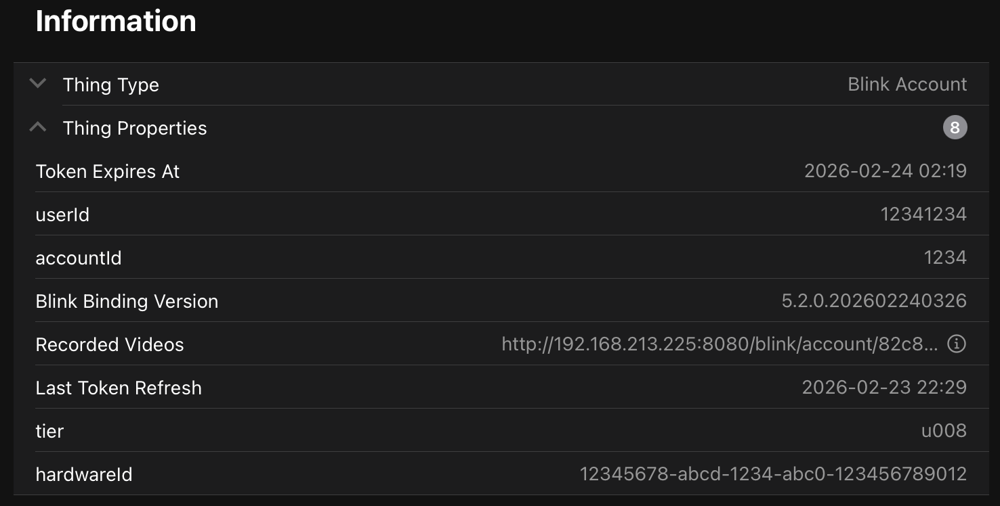

# Blink Binding

With this binding, you can use blink security cameras in OpenHAB.

Communication with the cameras is done using the blink API, as used by the official blink app.

Since the API can only be used for polling information, status information from the server is not received in real time.
A refresh interval can be set to poll the server for device information.

## Supported Things

- Blink Account
- Blink Network (optionally with a Sync Module)
- Blink Camera

## Discovery

In order to discover cameras, a blink account (aka bridge) has to be configured. After configuration, all available cameras
and networks will show up in auto-discovery.

## Blink Account (bridge)

The blink account is used to authenticate against the API. As of 2025, Blink solely supports the OAuth v2
protocol.  The initial email/password credentials must be provided in the Blink Account bridge configuration,
but subsequent authentication is performed via an access_token and a refresh_token.

### Thing Configuration

Configuration parameters are:

| Parameter         | Description                                    |
| ---------         | ---------------------------------------------- |
| email             | E-Mail address which is used in the blink app  |
| password          | Password which is used in the blink app        |
| refreshInterval   | Refresh interval for camera and network status. This should be used with caution, since there is the possibility that blink might enforce a lockout if the server gets hit too often. The official app polls every 30 seconds, so this should be considered the lowest value |
| mfaCode           | Upon initial login, Blink sends the user an MFA code, to their phone or email. Type it here. Once accepted, the field is cleared since it can only be used once |

### Channels

The Account Thing has no channels.

### Properties

The Account provides a number of interesting pieces of information in the Properties.
The most interesting property is the URL to a Recorded Videos web page. See the Recorded Videos section below.

## Blink Network

A blink network basically corresponds to the blink sync modules and groups cameras. A blink network can be armed,
activating all cameras which have motion detection enabled. Cameras with motion detection in a disarmed network won't
trigger alerts. In other words, both the cameras and the Network must be armed in order for motion detection to work.

It is possible to have a Network without a sync module, as the Doorbell and the Mini do not require a sync module.

### Thing Configuration

Configuration parameters will be set by auto-discovery after configuration of an account (there is no manual
setup needed).

| Parameter         | Description                       |
| ---------         | ----------------------------------|
| networkId         | Internal blink network ID         |

### Properties

Similar to the Blink Account Thing, the Blink Network Thing also has a number of Properties which may be interesting.

| Property                    | Description                       |
| --------                    | ----------------------------------|
| Local Storage Compatible?   | Is this sync module able to support a local storage (USB) device?         |
| Local Storage Enabled?      | Is this sync module configured in the Blink app to store your recordings? |
| Local Storage Status        | What is the status of your local storage device (e.g. "unavailable"       |
| Local Storage Compatible?   | Is this sync module able to support a local storage (USB) device?         |
| Storage Used                | The amount of local storage that your recordings are consuming            |
| Storage Total               | The amount of local storage available (i.e. the USB device capacity)      |
| Video Destination           | Indicates whether your Blink account is configured to store videos on the Blink Cloud, or locally |
| Sync Module Type            | Indicates the type of sync module you have (e.g. the generation)          |
| Sync Module Firmware Version | The version of the Blink firmware installed on your sync module          |
| Sync Module Serial Number   | The hardware serial number of your sync module                            |

### Channels

| channel  | type   | description                  |
|----------|--------|------------------------------|
| armed  | Switch | Arms/disarms the network. Overrides schedules which are set in the app  |

## Blink Camera

One single blink camera, belonging to a blink network (see below).

### Thing Configuration

Configuration parameters should be set by auto-discovery after configuration of an account exclusively (i.e. no manual
setup). For completeness, the configuration parameters set by auto-discovery are:

| Parameter         | Description                       |
| ---------         | ----------------------------------|
| networkId         | Internal blink network ID         |
| cameraId          | Internal blink camera ID          |
| cameraType        | Type of camera: CAMERA or OWL (blink mini) |

### Properties

Similar to the Blink Account Thing, the Blink Camera Thing also has a number of Properties which may be interesting.
Some properties will not appear for older cameras of cameras, or for doorbell cameras and mini cameras, as they do
not report the same level of detail that newer / full featured camera models do.

| Property                    | Description                       |
| --------                    | ----------------------------------|
| Thumbnail                   | In addition to the getThumbnail channel, the current thumbnail can be viewed at this URL      |
| Camera Model                | Indicates the model of camera (gen1 xt, gen2 xt2, gen3, etc etc)                              |
| Camera Revision             | Some cameras have been revised by Blink after initial release. This indicates your revision, if applicable     |
| Color                       | The exterior color of this camera (most are black, some are white)     |
| Serial Number               | The serial number of this camera     |
| Firmware Version            | The version of firmware on this camera. The blink system automatically updates the firmware periodically       |
| First Boot                  | The date/time when this camera was first booted. Its birthday, perhaps, should you choose to celebrate!     |
| Date Added to Network       | The date/time when this camera was added to the network. If you delete and readd a camera, this date would update     |
| Last Battery Voltage Check  | The date/time when this camera last checked its battery voltage. Once the batteries die, this stops updating (until you replace them) |
| MAC Address                 | The MAC address of the camera's wifi radio. This can be helpful for your internal DHCP or firewall rules     |
| IP Address                  | The IPv4 address of the camera's wifi radio. This can be helpful for your internal DHCP or firewall rules    |
| Power Source                | Indicates if this camera is currently powered by batteries, or from a USB power supply     |
| Network Error Count         | It is believed that this is a running counter of WiFi errors which have occurred over this camera's life     |

Besides the channels, the current thumbnail is also provided by a servlet. The url is set in the thing properties.

### Channels

| channel  | type   | description                  |
|----------|--------|------------------------------|
| motiondetection  | Switch | Enables/disables motion detection for this camera |
| motionTriggered | Trigger | Triggered when motion event is detected during account refresh. Therefore, this is linked to the refresh interval of the account and will not be in real-time |
| battery | LowBattery | Read-only channel, triggering ON when battery status is low. Not available in blink minis |
| batteryVoltage | Number | Read-only channel, displaying the voltage of the batteries inside, in Volts. Note: 1.7 is common when new, camera works down to about 1.4v. Not available in blink minis nor doorbelll |
| temperature | Number | Read-only channel, outputting camera temperature. Not available in blink minis nor doorbells |
| setThumbnail | Switch | Write-only channel, triggering taking a new snapshot as thumbnail. Also triggers a new getThumbnail state on completion, so you can see the new thumbnail |
| getThumbnail | Image | Read-only channel, returns the current thumbnail. Triggers a state change on new thumbnail.  Note: depending on your camera settings in the Blink app, you may be automatically updating this thumbnail when a motion event occurs |
| motionThumbnail | Image | Read-only channel, returns the thumbnail from the most recent motion detection event. Triggers a state change on new thumbnail  |
| lastCommunication | DateTime | (Advanced) Read-only channel, returns the date/time of the camera's communication to the Blink servers  |
| highUsageRate | Boolean | (Advanced) Read-only channel, returns the True(On) / False(Off) of whether Blink thinks this camera is experiencing high motion usage  |
| wifiLevel | Number | Read-only channel, returns a 1-5 rating of how "strong" the connection to your wifi router is  |
| wifiRssi | Number | Read-only channel, returns the Received Signal Strength Indicator measurement of communication to your wifi router, in dBm  |
| lfrLevel | Number | Read-only channel, returns a 1-5 rating of how "strong" the connection to your sync module is  |
| lfrRssi  | Number | Read-only channel, returns the Received Signal Strength Indicator measurement of communication to your sync module, in dBm  |

# Recorded Videos

There is a web page served from your openhab instance where your recorded videos can be displayed.
See the URL by navigating to your Blink Account Thing, and looking under Thing Properties.
Open the URL in a new browser tab/window and your history of recordings will be displayed.
(Note: support for locally stored videos is planned for a future release)

A screenshot of this web page is shown below:

### Mini View

In the lower left region of the page, a "swimlane" timeline view of recordings is shown, in a "mini view".
It is given this name because it is zoomed out to cover your entire Blink recording history (whatever Blink
has stored on their cloud servers), so everything is fairly small.

Each camera in your account is in its own swimlane (row). The X-Axis is time, and the date/time is labeled on
the top and bottom of the graph. Each colored rectangle represents a video recording, although when zoomed out
and looking at a large period of time, the rectangles may overlap.

There is a gray region of this mini view, which reflects the "zoomed in" region of time. This "zoomed in"
data is shown in the upper left region of the page, and is known as the "main view". You can zoom in and out
by using the scroll wheel of your mouse in the "main view" (safari not working in this way), or by pressing
and holding the left mouse button and moving the mouse up/down within the "main view", or by pointing to the
right or left edge of the gray region in the "mini view" and then dragging the edge wider or narrower. You
can move the gray region around the "mini view" by dragging the center of the gray region, or by pointing
to a different (non-gray) part of the "mini view", and click-drag-release to define a new region.

### Main View

Inside the "main view", all of the cameras are shown, in their own swimlanes (rows), larger than the "mini view".
When you hover over a rectange to briefly highlight it, or click on a rectangle to more persistently select it,
the thumbnail will appear in the upper right region of the screen (after a short delay to download the thumbnail).
If hovering, then the highlighted thumbnail will vanish once you move the mouse away (perhaps in search of a
different rectangle to look at its thumbnail). When you click on a rectangle, that selected thumbnail becomes
the "selected" one, and its thumbnail will linger on the right side of the page.

### Thumbnail / Video viewer

On the right side of the page where the selected thumbnail is displayed, a Watch Video is also shown. Click
Watch Video to download (into cache) and watch the recorded video clip.

In a future release, I plan to add the ability to download these videos to your local hard drive/NAS, and
optionally delete them from the Blink Cloud. Once deleted from the cloud, the Blink app will no longer be able
to display your videos; it isn't clear whether the Blink administrators will retain access to your "deleted"
videos. There is a lot of speculation about what corporations do with data that is collected by you and stored
by them. Note that using local storage instead of cloud storage does not necessarily eliminate the risk of the
corporation accessing and retaining your videos. Since you can watch "your" videos through the app, this means
that the Blink administrators are capable of watching "your" videos, even if they are stored on USB storage
devices on your sync modules. I don't know whether they *DO*, but I do know that they *CAN*.

### Cache Information

In the lower right portion of the page, there are some statistics regarding the cache of thumbnails and 
videos which are stored in memory in your openhab app. This cache is self-managed, with a high water mark
of 100 MB. Once the cache exceeds this amount, some videos and thumbnails are cleared from memory, until the
cache storage is reduced to 60% of the high water mark (i.e. 60 MB). You can temporarily clear the cache by
clicking the Clear Cache button, but as you click around on this page, the cache will grow again. Note that
each camera probably has a current thumbnail, and potentially a motion thumbnail, as these are available in
their respective Channels. Thus you will not typically see the cache remain at 0 thumbnails, even if you
do not interact with thumbnails displayed on this page. There is a possible future development task to
allow the cache size to be configurable, allowing you to choose a lean openhab instance, or a bigger and more
responsive instance.
