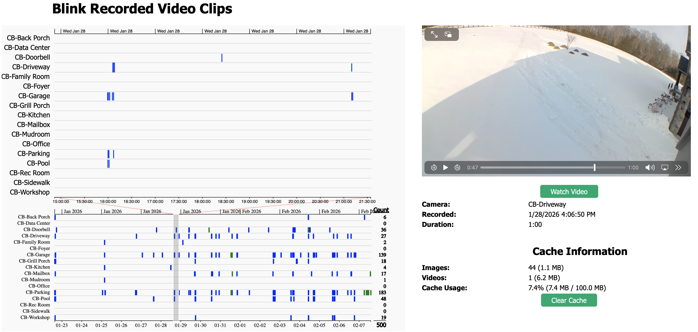

# Release Notes

## Changes in 5.2.0.202601151552

* authentication works again; Blink had modified their authentication method in mid 2025, which broke previous versions of this binding
* motion trigger events are now delivered to the camera’s Motion Triggered channel

## Changes in 5.2.0.202602072213

* On startup, the most recent motion thumbnail is published to the motion thumbnail channel (even if it's old; this is not a motion event!)
* Implemented Blink Recorded Clips web page: a swimlane viewer for thumbnails & videos (see screenshot below)
* Implemented 11 new properties (camera details) & 8 new channels (motion thumbnail, batt voltage, RSSI, etc)
#### Camera Detail Properties
1. Firmware Version
1. Power Source (usb or batteries)
1. First Boot date / time
1. Color (black or white)
1. MAC Address (useful for your advanced firewall / DHCP rules)
1. Camera Model (Gen 1 XT, Gen 2 XT2, Gen 3 Catalina, Gen 4 Sedona, White (gen 2 indoor), lotus (doorbell), owl (mini), etc)
1. Last Battery Voltage Check date / time
1. IP Address
1. Date Added to Blink Network (if you delete a camera in Blink, and readd it, this date changes)
1. Network Error Count (cameras with weak wifi or sync module connectivity will show errors here)
1. Serial Number
#### New Camera Channels
1. Battery Voltage (a measured voltage number like 1.65v)
1. Motion Thumbnail (the thumbnail of your most recent motion event)
1. Last Communication (Advanced)
1. High Usage Rate (Advanced)
1. WiFi Signal Strength (Advanced)
1. WiFi RSSI (Advanced)
1. Sync Module Signal Strength (Advanced)
1. Sync Module RSSI (Advanced)
#### Blink Recorded Video Clips

## Changes in 5.2.0.202602242208

* Added initial support for Sync Module info as part of the Network Thing, including wifi strength advanced channel
* Fix bug where Camera thing's "Power Source" did not properly reflect use of Batteries
* Updated README.md with more user documentation

